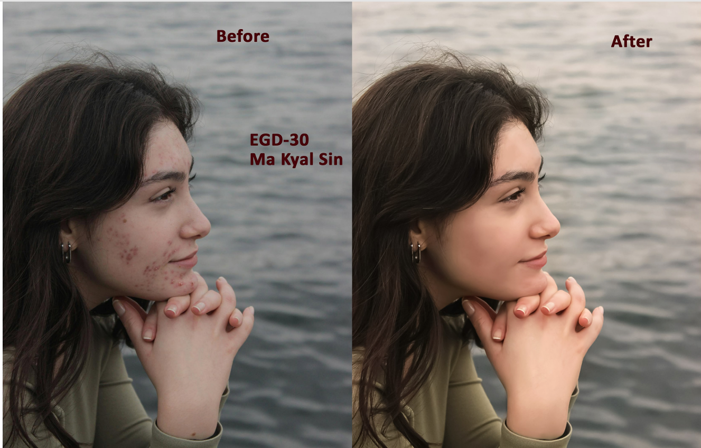

# Key Features
Photo Retouching: Professional skin retouching, clearing blemishes, and enhancing facial features while maintaining a natural look.

Color Correction: Adjusting tones and lighting to make images more vibrant and visually appealing.

Digital Enhancement: Transforming ordinary photos into high-quality digital assets.

# Featured Work
Photo Retouching (Before & After)
Below is an example of my retouching work, showing the transformation from the original image to the final enhanced version.

# Tools Used
Adobe Photoshop: For advanced retouching and photo manipulation.

Graphic Design Principles: Applied for better composition and aesthetic appeal.
